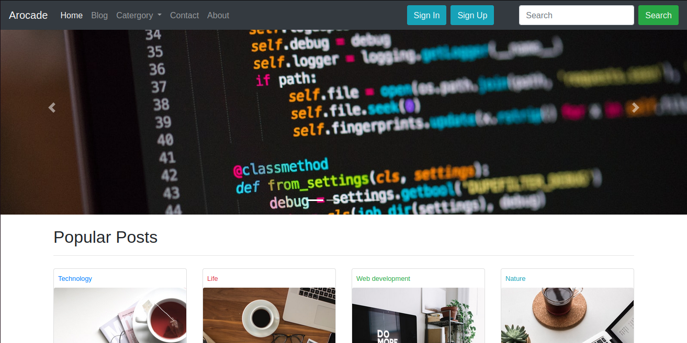

# My First Bootstrap Website

Welcome to my GitHub repository for my first Bootstrap website. This project showcases my skills in building a website using the Bootstrap framework.

## Table of Contents

- [Introduction](#introduction)
- [Features](#features)
- [Access my website](#AccessMyWebsite)

## Introduction

This project represents my initial exploration into web development with Bootstrap. It's a simple website designed to demonstrate my understanding of responsive design and front-end development using Bootstrap.

## Features

- Responsive design: The website is designed to look great on various devices and screen sizes.
- Bootstrap components: I have used Bootstrap's pre-built components to enhance the site's user interface.
- Custom styling: While Bootstrap provides a solid foundation, I've also added some custom CSS to personalize the website.

## Access my website
Go through this link - [Demo](https://anand-jaiswal-in.github.io/Bootstrap-website/)

---
Thankyou for coming to my github account. You certainly have to explore my another repositories.
